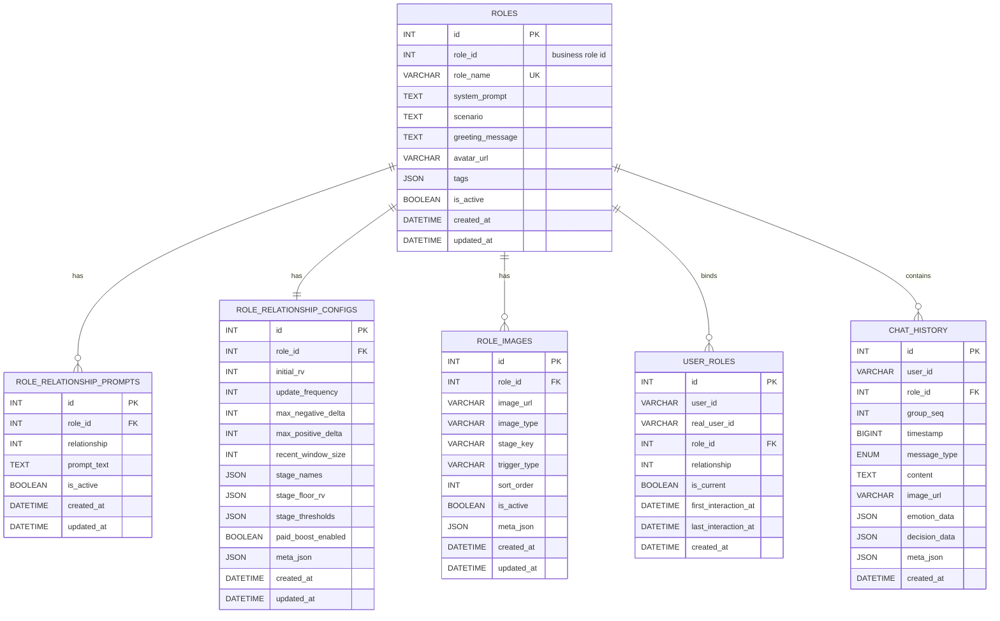

# Telegram AI Character 数据库 ER 图

本文档是当前底层数据表的 ER 图版说明，和 [DB_TABLE_RELATIONS.md](/Users/tchen/workspace/dev_engineer/pro/telegram-ai-character/DB_TABLE_RELATIONS.md) 配套使用。

## 1. ER 图

## 2. 主表定位

### 2.1 `roles`

- 角色主表
- 是所有其它业务表的中心
- 所有外键最终都围绕 `roles.id`

### 2.2 `role_relationship_prompts`

- 角色在不同关系阶段下的提示词表
- 一对多挂在 `roles`
- 按 `(role_id, relationship)` 唯一约束

### 2.3 `role_relationship_configs`

- 角色关系系统规则表
- 一对一挂在 `roles`
- 一个角色只有一套关系配置

### 2.4 `role_images`

- 角色图片资源池
- 一对多挂在 `roles`
- 支持头像、首图、阶段图、触发图扩展

### 2.5 `user_roles`

- 用户和角色的绑定关系表
- 保存“当前用户与当前角色的关系阶段”
- 预留 `real_user_id` 供后续统一用户体系接入
- 一个用户和一个角色只有一条记录

### 2.6 `chat_history`

- 用户与角色的消息流水表
- 存用户消息、角色文本回复、角色图片消息
- 按 `user_id + role_id + timestamp` 组织聊天时间线
- `group_seq` 用于标记一轮拆分回复属于同一组

## 3. 关系解读

## 3.1 角色维度

以 `roles` 为中心：

- 一个角色可以有多条阶段提示词
- 一个角色只有一套关系配置
- 一个角色可以有多张图片
- 一个角色可以被多个用户绑定
- 一个角色可以对应多条聊天消息

## 3.2 用户维度

当前 schema 没有单独 `users` 表，用户信息通过业务侧 `user_id` 表达：

- `user_roles.user_id` 负责保存用户和角色的当前绑定状态
- `user_roles.real_user_id` 预留给未来真实用户体系映射
- `chat_history.user_id` 负责保存用户和角色的消息历史

也就是说，当前用户侧主关联键是：

- `user_id`
- `role_id`

## 3.3 关系阶段维度

关系阶段当前落两层：

- 规则层：`role_relationship_configs`
- 提示词层：`role_relationship_prompts`
- 结果层：`user_roles.relationship`

职责分离如下：

- `role_relationship_configs` 决定“关系如何演进”
- `role_relationship_prompts` 决定“这个阶段用什么 prompt”
- `user_roles.relationship` 决定“用户当前处在哪个阶段”

## 4. 典型查询路径

## 4.1 查询当前用户正在聊的角色

路径：

- `user_roles`
- join `roles`

条件：

- `user_roles.user_id = ?`
- `user_roles.is_current = true`

## 4.2 查询当前阶段提示词

路径：

- `user_roles.relationship`
- `role_relationship_prompts.role_id + relationship`

说明：

- 先取用户当前关系阶段
- 再取该阶段对应提示词

## 4.3 查询聊天历史

路径：

- `chat_history`

条件：

- `user_id = ?`
- `role_id = ?`

排序：

- `timestamp asc`

## 4.4 查询角色首图/头像/阶段图

路径：

- 优先查 `role_images`
- 回退 `roles.avatar_url`

典型筛选维度：

- `role_id`
- `image_type`
- `stage_key`
- `trigger_type`
- `is_active`

## 5. 主键/外键规范

## 5.1 主键

- 所有表统一使用 `id` 作为数据库主键

## 5.2 业务键

- `roles.role_id` 是角色业务编号
- `user_id` 是用户业务编号

## 5.3 外键统一策略

- 所有角色相关从表都关联 `roles.id`
- 不直接关联 `roles.role_id`

原因：

- `roles.id` 是数据库内部稳定主键
- `roles.role_id` 更适合业务同步、迁移、外部接口识别

## 6. 建议的理解方式

如果从系统运行角度理解，可以把 6 张表看成三层：

### 6.1 角色定义层

- `roles`
- `role_relationship_prompts`
- `role_relationship_configs`
- `role_images`

### 6.2 用户状态层

- `user_roles`

### 6.3 消息历史层

- `chat_history`

## 7. 当前 ER 的优点

- 结构简单，主从关系清晰
- 没有多余的关系状态快照表
- 用户当前状态只保留一份
- 消息历史可直接用于前端展示和 RAG 索引
- 图片资源设计可平滑扩展

## 8. 当前 ER 的边界

- 没有独立 `users` 主表
- 没有独立 `conversations` 主表
- 没有关系变化事件日志表

这意味着：

- 当前系统更适合轻量单会话聊天产品
- 如果后续要做更细的审计、统计、会话管理，再考虑增加新表
